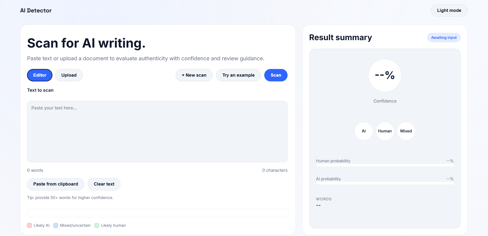
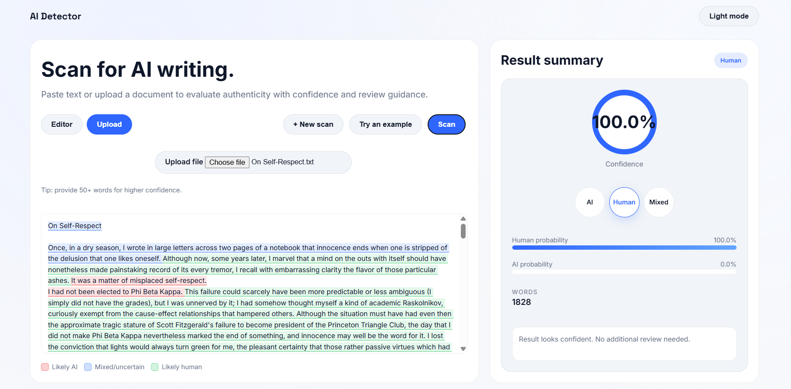
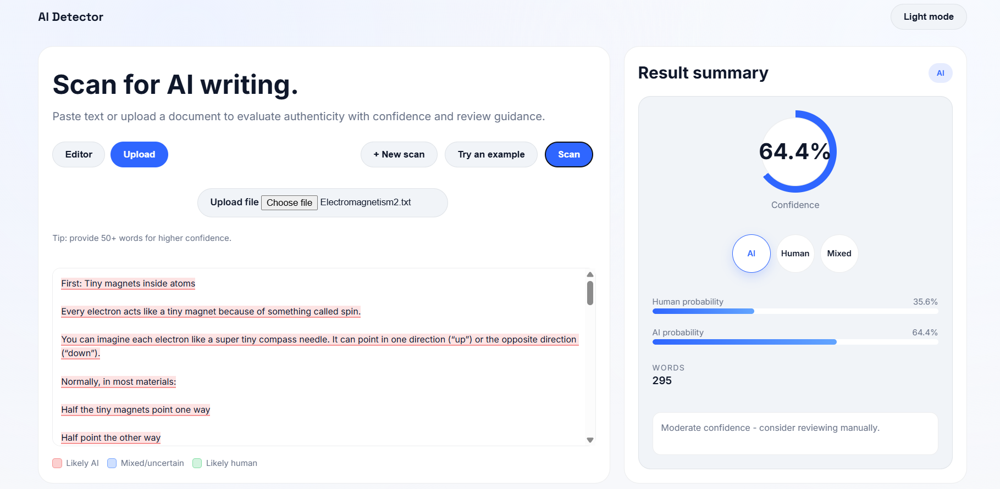
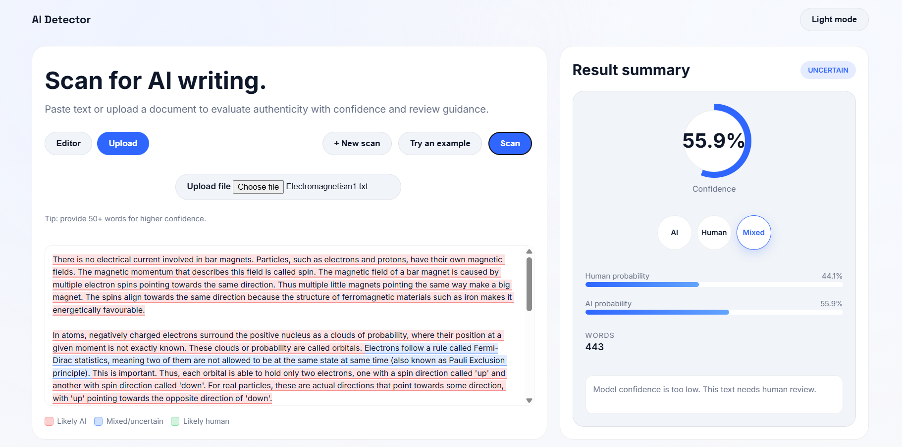
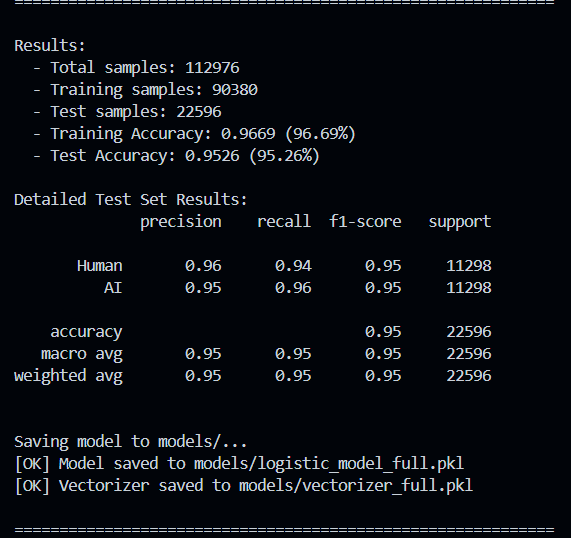

# AI Detector — ChatGPT vs Human Text Classifier

---

## Project Overview

This project detects whether a piece of text (such as an exam answer) was written by a **human student** or generated by **ChatGPT/AI**. It combines multiple machine learning approaches and serves predictions through a Flask web application.

**Final Model Performance:**
- Training Accuracy: **96.69%**
- Test Accuracy: **95.26%**
- F1-Score (both classes): **0.95**

---

## Project Structure

```
ai_detector/
│
├── data/
│   ├── master_training_data.csv       # Combined dataset from all sources
│   ├── raid_local.csv                 # RAID dataset (downloaded)
│   └── train_v2_drcat_02.csv          # DAIGT dataset (Kaggle)
│
├── frontend/
│   ├── app.js                         # Frontend JavaScript logic
│   ├── index.html                     # Main web interface
│   └── styles.css                     # Styling
│
├── models/
│   ├── logistic_model_full.pkl        # Trained logistic regression model
│   └── vectorizer_full.pkl            # Trained TF-IDF vectorizer
│
├── notebooks/
│   └── data_prep.ipynb                # Data preparation & experimentation
│
├── outputs/
│   └── tokenizer.json                 # Saved tokenizer config
│
├── src/
│   ├── models/
│   │   ├── __init__.py
│   │   ├── ensemble.py                # Ensemble voting system
│   │   ├── lstm_model.py              # Bidirectional LSTM model
│   │   └── neural_net.py              # Custom neural network
│   │
│   ├── preprocessing/
│   │   ├── __init__.py
│   │   ├── feature_engineering.py    # Feature extraction (burstiness, TTR, etc.)
│   │   └── ngram_extractor.py        # N-gram pattern analysis
│   │
│   ├── utils/
│   │   ├── __init__.py
│   │   ├── helpers.py                 # Shared utility functions
│   │   └── tokenizer.py              # Text tokenization logic
│   │
│   └── __init__.py
│
├── evaluate.py                        # Model evaluation script
├── predict.py                         # Prediction logic
├── train.py                           # Model training script
├── web_app.py                         # Flask web application
└── requirements.txt                   # Python dependencies
```

---

## Algorithms Used

| Algorithm | File | Purpose |
|---|---|---|
| TF-IDF Vectorizer | `utils/tokenizer.py` | Converts text to weighted numerical features |
| Logistic Regression | `train.py` | Primary fast classifier |
| Neural Network | `src/models/neural_net.py` | Learns complex non-linear patterns |
| Bidirectional LSTM | `src/models/lstm_model.py` | Captures sequence and writing flow |
| Ensemble Voting | `src/models/ensemble.py` | Combines all models with weighted voting |
| N-gram Analysis | `src/preprocessing/ngram_extractor.py` | Word pattern frequency analysis |
| Feature Engineering | `src/preprocessing/feature_engineering.py` | Burstiness, TTR, punctuation density etc. |

---

## Datasets Used

This project combines **4 datasets** into `master_training_data.csv`:

| Dataset | Source | Size Used | Type |
|---|---|---|---|
| RAID | `liamdugan/raid` (HuggingFace) | 10,000 rows | Multi-model AI vs Human |
| DAIGT | `train_v2_drcat_02.csv` (Kaggle) | 10,000 rows | Student essay style |
| HC3 | `Hello-SimpleAI/HC3` (HuggingFace) | ~24,000 pairs | Q&A: Human vs ChatGPT |
| GPT-Wiki-Intro | `aadityaubhat/GPT-wiki-intro` (HuggingFace) | 20,000 sampled | Wikipedia vs GPT rewrites |

> Large dataset files are included locally. Run `notebooks/data_prep.ipynb` to regenerate if needed.

---

## Confidence Thresholds

| Threshold | Value | Meaning |
|---|---|---|
| `HIGH_CONFIDENCE_THRESHOLD` | **70** | Above this → confident prediction |
| `LOW_CONFIDENCE_THRESHOLD` | **60** | Below this → uncertain, flagged for human review |
| `MIN_WORDS_FOR_ACCURACY` | **50** | Minimum words needed for reliable prediction |

> Answers with confidence between 60–70% are flagged as **uncertain** for human review — protecting students from false accusations.

---

## Three Test Cases

### Human-Written
Casual tone, irregular structure, personal voice → predicts **Human** (confidence > 70%)

### AI-Generated
Formal, smooth, structured vocabulary → predicts **AI** (confidence > 70%)

### Mixed (Human + AI edited)
Inconsistent style shifts → confidence 60–70% → flagged as **Uncertain, recommend human review**

---

## Setup Instructions

### 1. Create and activate virtual environment
```bash
python -m venv .venv

# Windows
.venv\Scripts\activate

# Mac/Linux
source .venv/bin/activate
```

### 2. Install dependencies
```bash
pip install -r requirements.txt
```

---

## How to Run

### Train the model
```bash
python train.py
```

### Evaluate the model
```bash
python evaluate.py
```

### Run the web app
```bash
python web_app.py
```
Then open: `http://127.0.0.1:5000`

---

## Screenshots

Flask web app homepage



Human text → confident Human prediction 

 

AI text → confident AI prediction

 

Mixed text → flagged as Uncertain 

 

Terminal: 95.26% test accuracy

 

---

## References

- Gehrmann et al. (2019). GLTR: Statistical Detection and Visualization of Generated Text. ACL.
- Mitchell et al. (2023). DetectGPT: Zero-Shot Machine-Generated Text Detection. ICML.
- Hochreiter & Schmidhuber (1997). Long Short-Term Memory. Neural Computation.
- Kleinberg (2002). Bursty and Hierarchical Structure in Streams.
- Vaswani et al. (2017). Attention Is All You Need. NeurIPS.
- Dugan et al. (2024). RAID: A Shared Benchmark for Robust Evaluation of Machine-Generated Text Detectors.
- Hello-SimpleAI (2023). HC3: Human ChatGPT Comparison Corpus. HuggingFace.